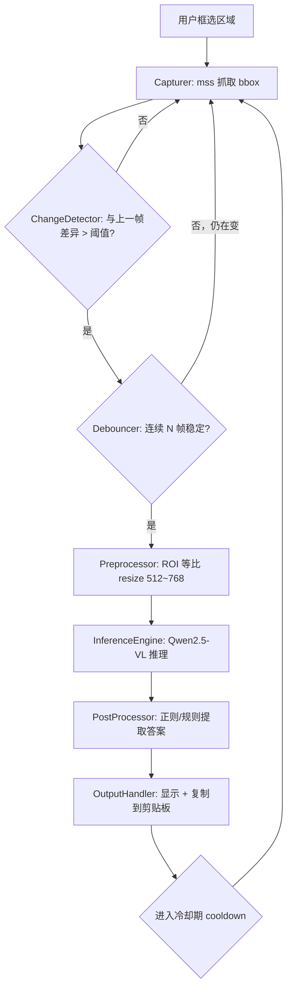
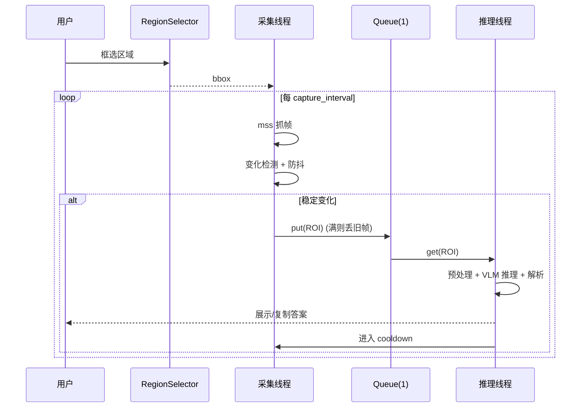

# altobid 架构设计文档

| 项目 | 内容 |
| --- | --- |
| 名称 | altobid |
| 目标 | 本地部署小参数多模态模型，解答小学题类型（简单算式）验证码 |
| 版本 | v0.1（设计稿） |
| 日期 | 2026-07-22 |

---

## 1. 概述

altobid 是一个**纯本地**运行的桌面辅助工具。用户手动框选屏幕上验证码所在的矩形区域，
工具用 `mss` 对该区域持续截图，通过**变化检测**判断画面是否刷新，只有当画面稳定地发生
变化时，才把经过 **ROI resize** 的单张图片送入本地多模态模型进行推理，输出算式答案。

核心设计取向：

- **省算力**：模型只在「画面确实变了且稳定下来」时才推理，绝大多数空闲帧被变化检测挡掉。
- **低时延**：模型常驻显存，输入分辨率受控（512~768），单次推理控制在亚秒级。
- **本地私密**：截图、推理、输出全程不出本机，无任何网络上传。

### 1.1 范围

**做**：区域框选、区域截图、变化检测与防抖、ROI 预处理、本地 VLM 推理、答案解析与展示。

**不做**：自动定位验证码位置、自动点击/回填表单、云端推理、复杂图形推理（滑块、点选、旋转）。
本工具面向「看图算算式」这一类题，不承诺覆盖所有验证码形态。

### 1.2 使用前提

仅用于使用者拥有合法授权的场景（自动化测试、辅助学习等），不得用于绕过他人系统安全机制。

---

## 2. 运行环境与约束

### 2.1 目标环境

| 项 | 值 |
| --- | --- |
| OS | Windows 11 |
| GPU | NVIDIA RTX 4080 Laptop（12 GB VRAM） |
| Python | **3.10 ~ 3.12**（建议） |
| 推理框架 | Transformers + Flash Attention 2 |
| 模型 | Qwen2.5-VL-3B-Instruct |

### 2.2 关键约束（务必先读）

1. **Python 版本**：当前机器默认 Python 为 3.14，而 `torch` / `transformers` / `flash-attn`
   目前尚无面向 3.14 的稳定官方 wheel。**必须为本项目单独创建 3.10~3.12 的虚拟环境**，
   否则依赖无法正常安装。

2. **Flash Attention 2 on Windows**：官方不提供 Windows 预编译 wheel。可选路径：
   (a) 使用社区预编译 wheel；(b) 本地 CUDA 工具链源码编译（耗时且易失败）。
   因此架构上**不把 FA2 当作硬依赖**：启动时探测，不可用则自动回退到 PyTorch 原生
   `sdpa`（Scaled Dot-Product Attention），保证「装不上 FA2 也能跑」。

3. **显存预算（12 GB 可容纳）**：

   | 权重格式 | 权重占用 | + KV/激活（短序列） | 合计估算 |
   | --- | --- | --- | --- |
   | fp16 | ~6.5 GB | ~1~2 GB | ~8 GB |
   | AWQ / GPTQ (4bit) | ~3~4 GB | ~1~2 GB | ~5 GB |

   fp16 与量化都能装下。量化可留出更多显存余量、降低加载时间，代价是极小的精度损失，
   对「读简单算式」这类任务几乎无影响，**推荐量化（AWQ/GPTQ）作为默认**。

4. **视觉 token 与分辨率**：Qwen2.5-VL 采用动态分辨率，图像越大产生的视觉 token 越多、
   推理越慢。本项目通过 `min_pixels` / `max_pixels` 把输入限制在 512²~768² 区间，
   在识别精度与速度间取平衡。

---

## 3. 总体架构

采用**采集线程 + 推理线程**的生产者–消费者结构，中间用一个容量为 1 的队列解耦，
避免推理耗时阻塞截图循环，也防止积压过期帧。

```
┌──────────────────────────────────────────────────────────────┐
│                          altobid                               │
│                                                                │
│  ┌────────────┐   一次性     ┌─────────────────────────────┐   │
│  │ RegionSelector│──bbox──▶  │        采集线程 (Producer)    │   │
│  └────────────┘             │                               │   │
│                             │  Capturer(mss) ──frame──▶      │   │
│                             │  ChangeDetector ──changed?──▶  │   │
│                             │  Debouncer ──stable?──▶        │   │
│                             └──────────┬────────────────────┘   │
│                                        │ 放入(maxsize=1)         │
│                                   ┌────▼─────┐                   │
│                                   │  Queue   │                   │
│                                   └────┬─────┘                   │
│                             ┌──────────▼────────────────────┐    │
│                             │        推理线程 (Consumer)      │    │
│                             │  Preprocessor(ROI resize) ──▶  │    │
│                             │  InferenceEngine(Qwen2.5-VL)──▶│    │
│                             │  PostProcessor(解析答案) ──▶    │    │
│                             │  OutputHandler(展示/复制) ──▶   │    │
│                             └───────────────────────────────┘    │
└──────────────────────────────────────────────────────────────┘
```

### 3.1 分层职责

| 层 | 组件 | 职责 |
| --- | --- | --- |
| 交互 | RegionSelector | 让用户拖拽框选屏幕矩形，返回 bbox |
| 采集 | Capturer | 用 mss 按固定间隔截取 bbox 区域 |
| 触发 | ChangeDetector / Debouncer | 判断画面是否变化、是否稳定，决定是否推理 |
| 处理 | Preprocessor | ROI 裁剪 + 等比 resize 到 512~768 |
| 推理 | InferenceEngine | 加载模型、构造 prompt、生成答案 |
| 输出 | PostProcessor / OutputHandler | 从模型文本提取答案并展示/复制 |
| 支撑 | Config / Logger | 集中配置、日志与可选调试帧落盘 |

---

## 4. 数据流



关键点：

- **变化检测挡住空闲帧**：画面不动时不进入后续任何流程，CPU/GPU 基本空转。
- **防抖等稳定**：验证码刷新常伴随淡入/动画，等连续 N 帧稳定再推理，避免抓到过渡帧。
- **冷却期防重复**：一次成功推理后进入 cooldown，避免答案展示动画本身又触发变化检测。

---

## 5. 模块详细设计

### 5.1 RegionSelector（区域框选）

- 职责：全屏半透明覆盖窗，用户按下-拖拽-松开框出矩形，返回 `(left, top, width, height)`。
- 实现：`tkinter` 全屏 `Canvas` 覆盖层（无额外依赖）；多显示器场景用 mss 的
  `monitors` 信息校正坐标偏移。
- 输出：bbox 交给 Capturer；仅在启动时执行一次，支持热键重新框选。

### 5.2 Capturer（区域截图）

- 职责：`mss.mss().grab(bbox)` 循环抓取，输出 `numpy` BGRA/BGR 帧。
- 频率：`capture_interval`（默认 200 ms ≈ 5 FPS，足够响应验证码刷新，又不吃满 CPU）。
- 注意：mss 实例**在使用它的线程内创建**（mss 非线程安全）。

### 5.3 ChangeDetector（变化检测）

- 目的：判断当前帧相对「上一次已处理帧」是否发生了有意义的变化。
- 方案（默认，轻量稳健）：
  1. 转灰度并缩小到固定小尺寸（如 64×64），消除噪声、抗轻微抖动；
  2. 与基准帧做绝对差 `cv2.absdiff`，统计「差异像素占比」；
  3. 占比 > `change_threshold`（默认 2%）判定为「变化」。
- 备选：感知哈希（pHash）汉明距离，抗压缩噪声更强，计算稍重，作为可切换策略。

### 5.4 Debouncer（防抖 / 稳定判定）

- 目的：确认画面「变完并稳定」，而非正处于刷新动画中。
- 策略：检测到变化后，进入观测态；要求**连续 `stable_frames`（默认 3）帧之间差异都低于
  稳定阈值**，才认定稳定并放行推理。若期间又剧烈变化，重置观测。
- 冷却：放行一次后，`cooldown`（默认 1.5 s）内不再触发，避免结果动画自触发。

### 5.5 Preprocessor（ROI 预处理）

- 职责：把裁出的 ROI 转成模型输入。
- 流程：BGR→RGB → 等比缩放使长边落在 512~768（通过 `max_pixels`/`min_pixels` 交给
  Qwen 处理器，或先用 `cv2.resize` 预缩放）→ 转 PIL Image。
- 原则：**只在需要推理时才预处理**，不对每个采集帧做重活。

### 5.6 InferenceEngine（推理引擎）

- 加载：`Qwen2_5_VLForConditionalGeneration.from_pretrained(...)` +
  `AutoProcessor`，模型常驻显存，仅在启动时加载一次。
- Attention 后端选择（启动探测，带回退）：

  ```python
  try:
      import flash_attn  # noqa
      attn_impl = "flash_attention_2"
  except Exception:
      attn_impl = "sdpa"   # Windows 缺 FA2 时的稳妥回退
  ```

- 输入：单张图 + 固定 system prompt + 精简 user prompt。
- 生成参数：见 §6。

### 5.7 PostProcessor（答案解析）

- 模型被约束为**只输出答案**，但仍需容错：用正则从返回文本中抽取数字/结果
  （如 `-?\d+`，或匹配「答案是 X」），取首个合理结果。
- 置信策略：若无法解析，标记为「未识别」，不误输出。

### 5.8 OutputHandler（输出）

- 默认：控制台/悬浮窗展示答案，并复制到剪贴板（`pyperclip` 可选）。
- 不做自动回填/点击（超出范围，且降低误操作风险）。

### 5.9 Config & Logger

- `config/default.yaml` 存放所有阈值与模型参数；`config/local.yaml`（gitignore）覆盖本地值。
- 可选 `debug.save_frames` 把触发推理的帧落盘到 `debug_frames/`，便于调参。

---

## 6. 模型与推理参数

| 参数 | 值 | 说明 |
| --- | --- | --- |
| model | Qwen2.5-VL-3B-Instruct | 小参数多模态 |
| dtype | fp16 | 12GB 可容纳；量化时随权重格式 |
| quantization | AWQ / GPTQ | 推荐默认，省显存、加载快 |
| attn | flash_attention_2 → sdpa | 探测回退 |
| max_new_tokens | 64 | 答案短，限制上限省时延 |
| temperature | 0.1 | 近确定性，减少胡乱发挥 |
| top_p | 0.8 | 配合低温 |
| image | 单张 | 每次只喂当前 ROI |
| image_size | 512 ~ 768 | 经 min/max_pixels 控制视觉 token |

### 6.1 Prompt 设计

- **System**：`你是一个只解答图片中算式的助手。只输出最终数字答案，不要任何解释、单位或标点。`
- **User**：`计算图中的算式，直接给出答案。` + 图像。

约束输出格式可显著降低 PostProcessor 的解析难度和 token 消耗。

---

## 7. 目录结构（规划）

```
altobid/
├─ README.md
├─ requirements.txt
├─ docs/
│  └─ architecture.md          # 本文档
├─ config/
│  ├─ default.yaml             # 默认阈值与模型参数
│  └─ local.yaml               # 本地覆盖（gitignore）
└─ altobid/
   ├─ __init__.py
   ├─ main.py                  # 入口：装配线程与组件
   ├─ config.py                # 配置加载
   ├─ selector.py              # RegionSelector
   ├─ capture.py               # Capturer (mss)
   ├─ change_detect.py         # ChangeDetector + Debouncer
   ├─ preprocess.py            # Preprocessor (ROI resize)
   ├─ engine.py                # InferenceEngine (Qwen2.5-VL)
   ├─ postprocess.py           # 答案解析
   └─ output.py                # OutputHandler
```

---

## 8. 运行时序



---

## 9. 性能与优化

- **模型常驻**：只加载一次，避免每次推理的加载开销。
- **变化检测前置**：绝大多数帧在灰度小图 absdiff 阶段就被过滤，几乎不耗 GPU。
- **队列容量 1 + 丢旧帧**：推理慢于采集时，只保留最新一帧，杜绝积压与过期答案。
- **分辨率封顶**：`max_pixels` 限制视觉 token 数，是控制单次推理时延的最关键旋钮。
- **量化优先**：AWQ/GPTQ 缩短加载、降低显存，为其他程序留出空间。
- **max_new_tokens=64**：答案短，硬上限避免偶发长输出拖慢。

## 10. 错误处理与降级

| 场景 | 处理 |
| --- | --- |
| flash-attn 不可用 | 回退 `sdpa`，日志告警，不中断 |
| 显存不足 (OOM) | 提示切换量化权重 / 调低 max_pixels |
| 模型输出无法解析 | 标记「未识别」，不误报答案 |
| 多显示器坐标偏移 | 用 mss monitors 信息校正 bbox |
| mss 跨线程 | 每线程独立创建 mss 实例 |

## 11. 配置项一览（default.yaml 草案）

```yaml
capture:
  interval_ms: 200
change_detect:
  method: absdiff          # absdiff | phash
  downscale: 64
  change_threshold: 0.02   # 差异像素占比
  stable_frames: 3
  cooldown_s: 1.5
preprocess:
  min_pixels: 262144       # 512*512
  max_pixels: 589824       # 768*768
model:
  path: ./models/Qwen2.5-VL-3B-Instruct-AWQ
  dtype: fp16
  attn: auto               # auto -> flash_attention_2 else sdpa
  max_new_tokens: 64
  temperature: 0.1
  top_p: 0.8
output:
  copy_to_clipboard: true
debug:
  save_frames: false
```

## 12. 后续演进

- 多题型/多行算式的分割与逐题识别
- 简单的置信度评估与「拿不准就不输出」策略
- 可选 llama.cpp / vLLM 后端对比时延与显存
- 框选区域持久化与多区域轮询

---

> 本文档为设计稿，`altobid/` 下模块尚未实现，结构与配置项在编码阶段可能微调。

