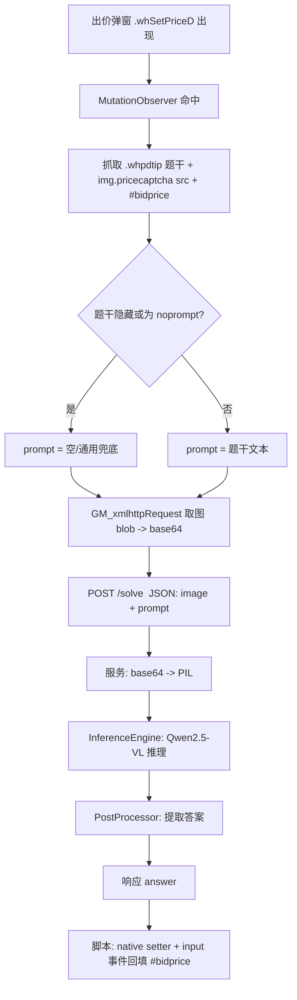

# altobid 架构设计文档

| 项目 | 内容 |
| --- | --- |
| 名称 | altobid |
| 目标 | 油猴脚本抓取网页出价弹窗的题干与图片，本地多模态模型作答并回填输入框 |
| 版本 | v0.2（重构：屏幕采集 → 油猴脚本 + 本地服务） |
| 日期 | 2026-07-23 |

---

## 1. 概述

altobid 由两个组件组成，通过本机回环 HTTP 协作：

1. **油猴脚本**（浏览器内）：监听拍牌出价弹窗 `.whSetPriceD` 的出现，抓取其中的
   **题干**（`.whpdtip`）与**题目图片**（`img.pricecaptcha`），请求本地服务得到答案后，
   自动把答案填入出价输入框 `#bidprice`。
2. **本地推理服务**（本机）：加载 Qwen2.5-VL-3B-Instruct，接收「题干 + 图片」，
   原生读图作答，返回纯答案。

核心设计取向：

- **本地私密**：图片只在 `浏览器 ↔ 127.0.0.1` 之间传输，不出本机，无公网上传。
- **题干驱动**：把页面上的题目文字作为模型 user prompt，让模型知道「要答什么」；
  无题干（隐藏或文本为 `noprompt`）时按纯图题处理，用通用兜底 prompt。
- **原生视觉理解**：Qwen2.5-VL 直接读图答题，不依赖 OCR + 文本推理的两阶段方案。
- **职责分离**：DOM 抓取/回填全在浏览器侧，模型推理全在服务侧，二者只靠一个 JSON 接口耦合。

### 1.1 范围

**做**：DOM 监听与抓取、图片取回并转 base64、本地 VLM 推理、答案解析、回填输入框。

**不做**：自动点击「确定」提交（仅回填，避免误操作）、云端推理、验证码定位以外的页面自动化。

### 1.2 使用前提

仅用于使用者拥有合法授权的场景（自动化测试、辅助学习等），不得用于绕过他人系统安全机制。

---

## 2. 为什么是「油猴脚本 + 本地服务」

油猴脚本运行在浏览器 JS 沙箱里，**无法加载 PyTorch / 本地大模型**；而模型推理必须在
Python 进程里跑。因此拆成两半：

- 浏览器侧做它擅长的事：读 DOM、取图、回填。
- Python 侧做它擅长的事：常驻模型、推理。

二者用**本机回环 HTTP（127.0.0.1）**通信。跨域由 `GM_xmlhttpRequest` + `@connect` 解决
（脚本发起的请求不受页面 CORS 限制，也能带上站点 cookie 取图）。

---

## 3. 目标页面结构

三份样本见 [HTMLs/](../HTMLs/)。稳定锚点：

| 元素 | 选择器 | 说明 |
| --- | --- | --- |
| 弹窗根 | `.whSetPriceD` | 出价弹窗容器，监听它的出现作为触发点 |
| 题干 | `.whpdtip` | 题目文字；可能 `style="display:none"` 且内容为 `noprompt`（纯图题） |
| 题目图片 | `img.pricecaptcha` | 验证码/题目图，取 `src` |
| 输入框 | `#bidprice` | 答案回填目标 |

题干形态差异（来自样本）：

- `box-1`：`<div class="whpdtip" style="display:none"><span>noprompt</span></div>` → **无题干**，纯图算式题。
- `box-2`：`<div class="whpdtip" style="font-size:19.5px">请输入"飞机"图标下方数字中的三位彩色数字</div>` → 有题干，且直接是文本节点（无 `<span>`）。
- `box-3`：`<div class="whpdtip"><span>请输入四位图形校验码</span></div>` → 有题干。

（`site1.html` 是宿主整页，出价弹窗由页面 JS 动态注入，静态 HTML 中不含 `.whSetPriceD`。）

因此题干提取需：取 `.whpdtip` 的 `textContent` 去空白；若元素隐藏或文本等于 `noprompt`
则视为无题干。

---

## 4. 数据流



---

## 5. 组件详细设计

### 5.1 油猴脚本 `userscript/altobid.user.js`

- **头部元数据**：`@match` 目标站点、`@grant GM_xmlhttpRequest`、`@connect 127.0.0.1`。
- **触发**：`MutationObserver` 观察 `document.body`，命中新出现的 `.whSetPriceD`
  （或其内部 `img.pricecaptcha` 完成加载）后触发一次抓取；对同一弹窗去重，避免重复请求。
- **抓题**：
  - 题干：`el.querySelector('.whpdtip')` → 判隐藏（`display:none`）/`textContent==='noprompt'`
    → 决定是否带 prompt。
  - 图片：`img.pricecaptcha` 的 `src`；用 `GM_xmlhttpRequest({responseType:'blob'})` 取回，
    `FileReader` 转 base64（避免 canvas 跨域污染取不到 dataURL）。
- **请求**：`GM_xmlhttpRequest` POST `http://127.0.0.1:<port>/solve`，body 为
  `{"image": "<base64>", "prompt": "<题干或空>"}`。
- **回填**：目标站为 React 受控输入，直接赋值 `.value` 不触发状态更新，需用
  **原生 value setter + 派发 `input` 事件**：

  ```js
  const setter = Object.getOwnPropertyDescriptor(
    window.HTMLInputElement.prototype, 'value').set;
  setter.call(input, answer);
  input.dispatchEvent(new Event('input', { bubbles: true }));
  ```

- **不自动提交**：仅回填，是否点「确定」交给使用者。

### 5.2 推理服务 `altobid/server.py`

- 框架：Flask，仅绑定 `127.0.0.1`（无鉴权，**不得对外暴露**）。
- 启动时构建 `InferenceEngine`（模型常驻显存，仅加载一次）。
- 路由：
  - `POST /solve`：`{image(base64), prompt?}` → base64 解码为 `PIL.Image`
    → `engine.infer(image, prompt)` → `PostProcessor.clean(raw)` →
    `{"answer": "...", "raw": "...", "latency_ms": N}`。
  - `GET /health`：返回模型是否就绪，供脚本轮询启动状态。
- 错误：解码失败/推理异常返回 4xx/5xx + JSON 错误信息，脚本侧不回填。

### 5.3 InferenceEngine `altobid/engine.py`（沿用，微调）

- 加载与量化逻辑不变（FA2 探测回退、NF4、CPU/GPU 自适应、缺权重降级假推理）。
- **改动**：`infer(image, prompt=None)` 增加可选 `prompt` 参数——非空时作为 user prompt
  覆盖默认值，实现「题干驱动」。system prompt 仍为固定的「只输出答案」约束。

### 5.4 Preprocessor `altobid/preprocess.py`（沿用，微调）

- 原来处理 `numpy` BGR 帧；现输入已是 `PIL.Image`。
- 分辨率控制交给 Qwen processor 的 `min_pixels/max_pixels`；`smart_resize` 逻辑保留，
  按需对超大图预缩放。

### 5.5 PostProcessor `altobid/postprocess.py`（沿用）

- 从模型文本抽取答案：数字优先，其次字母选项，兜底返回清洗后的末行。
- 注：部分题型答案是**多位数字串**（如三位彩色数字、四位校验码），提取规则保留整段数字。

### 5.6 Config `altobid/config.py`（沿用，新增 server 段）

- `config/default.yaml` 新增 `server: {host, port}`；移除已废弃的
  `capture` / `change_detect` / `output` / `debug` 段。

---

## 6. 模型与推理参数

| 参数 | 值 | 说明 |
| --- | --- | --- |
| model | Qwen2.5-VL-3B-Instruct | 小参数多模态（官方 fp16 权重） |
| dtype | fp16 | NF4 时作为 4bit 计算精度 |
| quantization | nf4（默认）/ none | bitsandbytes 运行时 4bit；none 为原始 fp16 |
| attn | flash_attention_2 → sdpa | 探测回退 |
| max_new_tokens | 64 | 答案短，限制上限省时延 |
| temperature | 0.1 | 近确定性，减少胡乱发挥 |
| top_p | 0.8 | 配合低温 |

### 6.1 Prompt 设计

- **System**：`你是一个网页验证码识别助手。仔细看图并按要求作答，只输出最终答案，不要解释过程、不要单位符号、不要标点。`
- **User**：有题干时用**页面题干**（如「请输入"飞机"图标下方数字中的三位彩色数字」）；
  无题干（纯图算式）时用通用兜底 `识别并回答图中的问题，直接给出答案。` + 图像。

页面题干直接作为指令，显著提升非算式题（如按颜色/位置挑数字）的正确率。

---

## 7. 目录结构（规划）

```
altobid/
├─ README.md
├─ requirements.txt
├─ config.example.yaml
├─ HTMLs/                       # 目标页面弹窗样本
├─ docs/
│  ├─ architecture.md           # 本文档
│  └─ development.md            # 实现步骤
├─ config/
│  ├─ default.yaml             # 默认参数（server + preprocess + model + logging）
│  └─ local.yaml               # 本地覆盖（gitignore）
├─ userscript/
│  └─ altobid.user.js          # 油猴脚本（浏览器侧）
└─ altobid/
   ├─ __init__.py              # 日志基础设施
   ├─ server.py                # Flask 推理服务（新入口）
   ├─ config.py                # 配置加载
   ├─ preprocess.py            # PIL 预处理
   ├─ engine.py                # InferenceEngine (Qwen2.5-VL)
   └─ postprocess.py           # 答案解析
```

移除的模块（相对 v0.1）：`selector.py` `capture.py` `change_detect.py`
`output.py` `debug.py` `main.py`——屏幕采集/框选/变化检测整条链路不再需要。

---

## 8. 安全与约束

| 项 | 说明 |
| --- | --- |
| 服务仅本机 | Flask 绑定 `127.0.0.1`，无鉴权，禁止 `0.0.0.0` 或公网暴露 |
| 跨域取图 | 用 `GM_xmlhttpRequest` + `@connect`，绕过页面 CORS 并携带站点 cookie |
| React 回填 | 必须用原生 value setter + `input` 事件，否则框架状态不更新 |
| Python 版本 | 3.10~3.12，torch/transformers 无 3.13+ 稳定 wheel |
| 显存 | NF4 ~2.5GB；12GB 卡可关量化用 fp16 |
| FA2 on Windows | 无官方 wheel，缺失自动回退 `sdpa` |

---

## 9. 错误处理与降级

| 场景 | 处理 |
| --- | --- |
| 服务未启动 | 脚本 `/health` 轮询失败则不抓题，控制台告警 |
| 取图失败 | GM_xmlhttpRequest onerror → 跳过本次，不回填 |
| 模型输出无法解析 | 返回清洗后文本，脚本可选择是否回填 |
| flash-attn 不可用 | 回退 `sdpa`，日志告警，不中断 |
| 显存不足 (OOM) | 确认 quantization=nf4 / 调低 max_pixels |
| 权重/依赖缺失 | 引擎降级假推理，便于无 GPU 环境跑通流程 |

---

## 10. 后续演进

- 服务端答案缓存（同一图 URL 命中直接返回）
- 脚本侧可选「自动提交」开关
- 置信度评估与「拿不准不回填」策略
- 多站点 `@match` 与选择器配置化

---

> 本文档为 v0.2 重构设计稿。`server.py` / `userscript/` 为规划新增，编码阶段细节可微调。
